# Mind Map для дипломного проекта ERP System

```mermaid
mindmap
  root((ERP System))
    Пользовательский интерфейс (UI)
      Авторизация
        Проверка пустых полей email и password
        Проверка неверного логина или пароля
        Проверка успешного входа
        Проверка передачи JWT токена
      Работа со справочниками
        Создание пользователя
        Создание клиента
        Создание поставщика
        Создание категории товара
        Создание товара
      Проверка пользовательских сценариев
        Корректность сообщений об ошибках
        Корректность отображения списков
        Проверка обязательных полей
    Бизнес-логика (API)
      Auth API
        POST /api/auth/login
        Возврат JWT токена
        Ответы сервера
          200 Успешная аутентификация
          400 Некорректное тело запроса
        Ошибка 401 при неверных данных
      Users API
        POST /api/users
        GET /api/users
        Проверка уникальности email
        Ответы сервера
          200 Список пользователей
          201 Пользователь создан
          400 Ошибка валидации
          409 Email уже существует
      Clients API
        POST /api/clients
        GET /api/clients
        Ответы сервера
          200 Список клиентов
          201 Клиент создан
          400 Ошибка валидации
      Suppliers API
        POST /api/suppliers
        GET /api/suppliers
        Ответы сервера
          200 Список поставщиков
          201 Поставщик создан
          400 Ошибка валидации
      Product Categories API
        POST /api/product-categories
        GET /api/product-categories
        Проверка parentId
        Ответы сервера
          200 Список категорий
          201 Категория создана
          400 Неверный parentId или пустое имя
      Products API
        POST /api/products
        GET /api/products
        Проверка categoryId и unitId
        Автосоздание General и pcs
        Ответы сервера
          200 Список товаров
          201 Товар создан
          400 Ошибка валидации
          400 Category или Unit не найдены
      Purchases API
        POST /api/purchases/orders
        GET /api/purchases/orders
        Проверка supplierId
        Проверка productId
        Проверка строк заказа
        Ответы сервера
          200 Список закупок
          201 Заказ закупки создан
          400 Supplier не найден
          400 Product не найден
      Sales API
        POST /api/sales/orders
        GET /api/sales/orders
        Проверка clientId
        Проверка productId
        Проверка строк заказа
        Ответы сервера
          200 Список продаж
          201 Заказ продажи создан
          400 Client не найден
          400 Product не найден
      Stock API
        GET /api/batches
        GET /api/warehouses
        GET /api/stock/movements
        Проверка формата даты и чисел
        Ответы сервера
          200 Списки успешно получены
          401 Нет JWT для защищенного маршрута
    База данных
      Справочники
        roles
        users
        clients
        suppliers
        units
        product_categories
        products
        warehouses
      Операционные таблицы
        purchase_orders
        purchase_order_items
        sales_orders
        sales_order_items
        batches
        stock_movements
      Проверки БД
        Наличие записей после POST запросов
        Корректность внешних ключей
        Уникальность users.email
        Уникальность roles.name
        Проверка каскадного удаления строк заказа
        Проверка set null для отдельных связей
        Проверка точности quantity и price
        Проверка формата дат
      Транзакционность
        Ошибка в одной строке заказа не должна сохранять документ частично
    Безопасность
      JWT авторизация
        Доступ к защищенным маршрутам только с токеном
        Отказ без токена
        Отказ с невалидным токеном
      Валидация данных
        Проверка обязательных полей
        Проверка форматов email и password
        Проверка несуществующих ID
      Защита данных
        Контроль ролей пользователей
        Проверка ссылочной целостности
        Исключение дублирующих записей
    Инструменты тестирования
      Postman
        Проверка API
        Проверка кодов ответа
        Проверка JWT
      Swagger UI
        Проверка контрактов API
        Быстрый ручной прогон маршрутов
      DBeaver или pgAdmin
        Выполнение SQL запросов
        Проверка таблиц и связей
      Selenium
        Использовать при появлении отдельного frontend
```

Короткое пояснение под схемой:

`На интеллект-карте представлены основные направления тестирования системы: пользовательский интерфейс, API, база данных, безопасность и применяемые инструменты. Схема отражает взаимосвязь между функциональными модулями проекта и проверками, необходимыми для подтверждения корректности работы приложения.`
