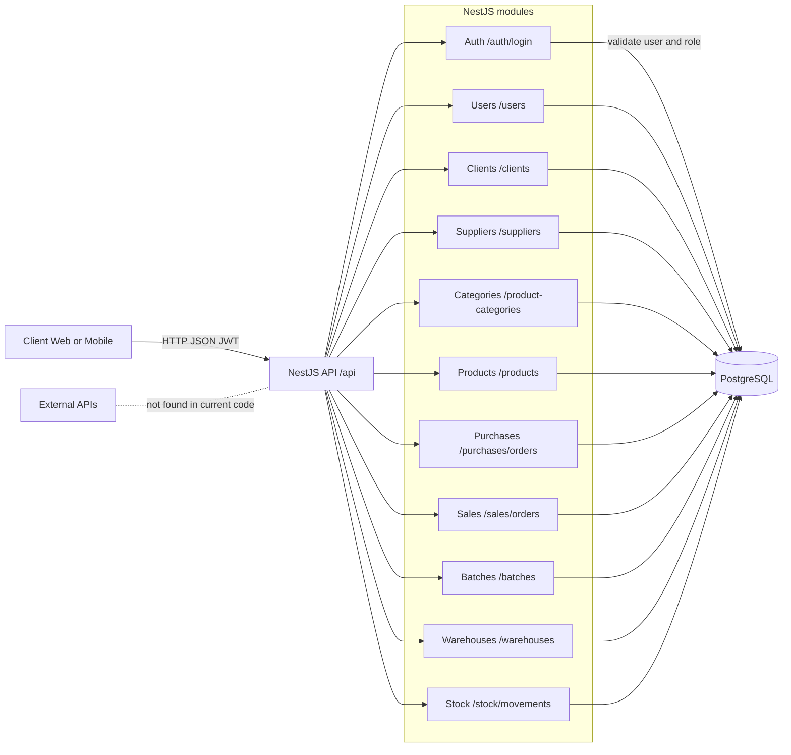

# Анализ архитектуры и план тестирования ERP System

## 1. Схема взаимодействия компонентов

В текущем репозитории реализован backend (NestJS + Fastify). Отдельного фронтэнда нет, поэтому в схеме клиент представлен как внешний Web/Mobile UI, который обращается к REST API.



Если `mermaid` не поддерживается в твоем viewer, используй эту схему:

```text
[Client: Web/Mobile Frontend]
            |
            | HTTP/JSON + JWT
            v
      [NestJS API /api]
            |
            +--> Auth (/auth/login)
            +--> Users (/users)
            +--> Clients (/clients)
            +--> Suppliers (/suppliers)
            +--> Product Categories (/product-categories)
            +--> Products (/products)
            +--> Purchases (/purchases/orders)
            +--> Sales (/sales/orders)
            +--> Batches (/batches)
            +--> Warehouses (/warehouses)
            +--> Stock (/stock/movements)
            |
            v
        [PostgreSQL]

[External APIs] -> в текущем коде не обнаружены
```

## 2. Какие данные хранятся в БД и как влияют на работу приложения

### Пользователи и доступ

- `roles` (роли пользователей).
- `users` (email, пароль, ФИО, роль, дата создания).
- Влияние:
  - вход в систему через `/auth/login`;
  - выдача JWT с ролью;
  - доступ к большинству маршрутов защищен `JwtAuthGuard`, публичные: `/auth/login`, `POST /users`.

### Справочники контрагентов и номенклатуры

- `clients` (клиенты).
- `suppliers` (поставщики).
- `units` (единицы измерения).
- `product_categories` (категории, включая иерархию parent-child).
- `products` (товар, категория, единица, цена).
- Влияние:
  - используются как зависимости в заказах и поставках;
  - без валидных ссылок (FK) создание документов невозможно;
  - при создании товара без `categoryId/unitId` автоматически создаются/используются значения по умолчанию (`General`, `pcs`).

### Операционные документы

- `purchase_orders`, `purchase_order_items` (закупки у поставщиков).
- `sales_orders`, `sales_order_items` (продажи клиентам).
- Влияние:
  - фиксируют бизнес-операции закупки/продажи;
  - цена строки заказа берется из текущей цены товара в `products`;
  - статус заказа хранится в БД (`created` на старте).

### Склад и партии

- `batches` (партии товара, срок годности, количество, связь с поставкой).
- `warehouses` (склады).
- `stock_movements` (движения по складу: склад, партия, товар, дельта количества, дата).
- Влияние:
  - партии и движения формируют учет запасов;
  - движения связаны с товарами, складами и партиями через FK, что предотвращает «висячие» записи.

### Целостность данных

- В БД настроены внешние ключи и ограничения `ON DELETE/ON UPDATE`:
  - запрет удаления родительских сущностей при наличии зависимых (`restrict`);
  - каскадное удаление строк заказа при удалении заказа (`cascade`);
  - обнуление ссылки на родителя/заказ в отдельных случаях (`set null`).
- Это влияет на стабильность API: некорректные ссылки и несогласованные операции отсекаются на уровне БД и/или репозиториев.

## 3. План тестирования (1–2 страницы)

### 3.1 Цели тестирования

- Проверить корректность API-модулей, влияющих на бизнес-потоки ERP.
- Подтвердить работу аутентификации/авторизации.
- Проверить корректность записи и чтения данных в PostgreSQL.
- Убедиться в целостности данных после пользовательских действий.

### 3.2 Модули для тестирования

- `Auth`:
  - логин с валидными/невалидными данными;
  - проверка выдачи JWT и доступа к защищенным маршрутам.
- `Users`:
  - создание пользователя;
  - уникальность email;
  - назначение/создание роли.
- `Clients` и `Suppliers`:
  - CRUD-база (в проекте реализованы list/create);
  - валидация обязательных полей.
- `Product Categories`:
  - создание корневой и дочерней категории;
  - отказ при несуществующем `parentId`.
- `Products`:
  - создание товара с явной категорией/единицей;
  - создание без `categoryId/unitId` (проверка автосоздания default-значений);
  - проверка цен и форматов данных.
- `Purchases`:
  - создание заказа поставки с несколькими позициями;
  - отказ при неверном `supplierId`/`productId`;
  - проверка, что в `purchase_order_items` записывается цена из `products`.
- `Sales`:
  - аналогично `Purchases` для клиентов и `sales_order_items`.
- `Batches`, `Warehouses`, `Stock`:
  - корректное чтение списков;
  - проверка корректного преобразования числовых/дата-полей в ответах.

### 3.3 Инструменты

- `Postman`:
  - ручное и полуавтоматическое API-тестирование;
  - коллекции запросов и environment-переменные (`baseUrl`, `token`).
- `Selenium`:
  - применим при наличии frontend (в текущем репозитории frontend отсутствует);
  - планируется для E2E сценариев пользовательского интерфейса после подключения клиента.
- `Dbeaver || PgAdmin`:

### 3.4 Подход к проверке БД

- Проверка наличия записей:
  - после каждого `POST` в API выполнять `SELECT` по созданным `id`;
  - сверять количество строк до/после операции.
- Проверка связности и ссылочной целостности:
  - подтверждать, что `role_id`, `supplier_id`, `client_id`, `product_id`, `batch_id`, `warehouse_id` ссылаются на существующие записи;
  - негативные тесты: попытка создать документ с несуществующими FK.
- Проверка транзакционной целостности:
  - при ошибке в одном из item (например, несуществующий `productId`) заказ и строки не должны записываться частично.
- Проверка консистентности бизнес-данных:
  - цена в `sales_order_items`/`purchase_order_items` должна соответствовать цене в `products` на момент создания;
  - формат чисел (`numeric`) и дат должен сохраняться корректно.
- Проверка ограничений и уникальности:
  - `users.email` и `roles.name` уникальны;
  - тестировать конфликтные вставки и ожидаемые ошибки.

### 3.5 Критерии завершения

- Все приоритетные API-сценарии (позитивные/негативные) пройдены.
- Ошибки валидации и авторизации возвращают корректные HTTP-коды.
- Данные в БД после тестов соответствуют ожиданиям и не нарушают FK/уникальность.
- Подготовлен отчет: сценарий, шаги, фактический результат, SQL-подтверждение.
