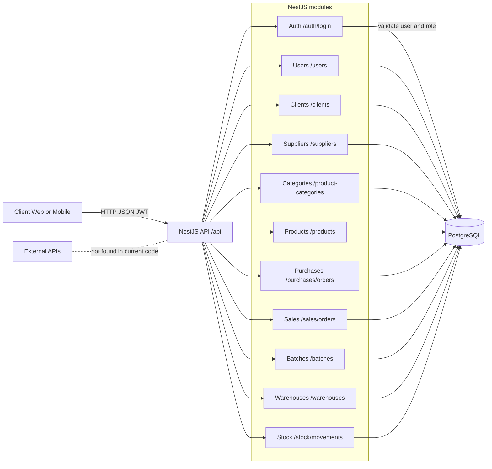

# Анализ проекта и план тестирования ERP System

## 1. Схема взаимодействия компонентов

В текущем репозитории реализован backend на `NestJS + Fastify`. Отдельного frontend-приложения в кодовой базе нет, поэтому клиентом выступает внешний веб-интерфейс, мобильный клиент или инструменты вроде Swagger UI/Postman.

Основные пути взаимодействия:

- `POST /api/auth/login`: клиент отправляет email и пароль, сервер проверяет пользователя в БД и возвращает JWT.
- Защищенные маршруты: клиент передает `Bearer`-токен, `JwtAuthGuard` разрешает доступ к API-модулям.
- `users`, `clients`, `suppliers`, `product-categories`, `products`: работа со справочниками, которые затем используются в заказах и складском учете.
- `sales/orders` и `purchases/orders`: создание документов продаж и закупок с записью заголовка заказа и его строк в БД.
- `batches`, `warehouses`, `stock/movements`: чтение складских данных и движений товаров.

## 2. Какие данные хранятся в БД и как они влияют на работу приложения

### Пользователи и доступ

- `roles`: роли пользователей.
- `users`: email, пароль, ФИО, роль, дата создания.
- Влияние на работу:
  - обеспечивают вход в систему;
  - роль попадает в JWT и влияет на контекст пользователя;
  - почти все маршруты защищены `JwtAuthGuard`, публичными сделаны только логин и создание пользователя.

### Справочники

- `clients`: данные клиентов.
- `suppliers`: данные поставщиков.
- `units`: единицы измерения товара.
- `product_categories`: категории товаров с поддержкой родительской категории.
- `products`: товар, цена, ссылка на категорию и единицу измерения.
- Влияние на работу:
  - являются источником данных для заказов и складского учета;
  - без существующих клиентов, поставщиков и товаров заказы создать нельзя;
  - при создании товара без категории и единицы измерения сервер автоматически создает или использует `General` и `pcs`.

### Операционные документы

- `purchase_orders`, `purchase_order_items`: закупки у поставщиков.
- `sales_orders`, `sales_order_items`: продажи клиентам.
- Влияние на работу:
  - фиксируют бизнес-операции закупки и продажи;
  - в строку заказа записывается цена товара из таблицы `products` на момент создания;
  - начальный статус документов задается сервером как `created`.

### Складской учет

- `batches`: партии товаров, дата поступления, срок годности, количество, связь с закупкой.
- `warehouses`: склады.
- `stock_movements`: движения товара по складу, включая товар, партию, склад, изменение количества и дату.
- Влияние на работу:
  - позволяют хранить историю прихода и движения товара;
  - используются для контроля остатков и прослеживаемости партий;
  - связи через внешние ключи не дают создать движение для несуществующего товара, партии или склада.

### Целостность данных

- В БД настроены внешние ключи, `unique`-ограничения и каскадные правила.
- Это влияет на приложение так:
  - нельзя создать запись с несуществующими ссылками;
  - нельзя повторно создать пользователя с тем же `email`;
  - строки заказов удаляются вместе с заказом;
  - часть ссылок обнуляется через `set null`, если это допустимо по модели данных.

## 3. План тестирования

### Какие модули тестировать

- `Auth`: вход, получение JWT, отказ при неверном логине или пароле.
- `Users`: создание пользователя, уникальность email, назначение роли.
- `Clients` и `Suppliers`: создание и получение списков контрагентов.
- `Product Categories`: создание обычной и дочерней категории, отказ при неверном `parentId`.
- `Products`: создание товара, проверка цены, проверка автосоздания категории и единицы измерения по умолчанию.
- `Purchases`: создание заказа закупки, запись строк заказа, отказ при неверном `supplierId` или `productId`.
- `Sales`: создание заказа продажи, запись строк заказа, отказ при неверном `clientId` или `productId`.
- `Batches`, `Warehouses`, `Stock`: получение списков, корректное отображение числовых и датовых полей.

### Какие инструменты использовать

- `Postman`: ручное тестирование REST API, проверка кодов ответа, тел запросов и JWT-авторизации.
- `Swagger UI`: быстрый прогон и проверка контрактов API по `swagger/swagger.yaml`.
- `DBeaver`, `pgAdmin`:
  - использовать для просмотра таблиц и выполнения SQL-проверок.
- `Selenium`: использовать только если позже появится отдельный frontend; в текущем репозитории UI для автоматизации отсутствует.

### Как проверять базу данных

- Проверка наличия записей:
  - после `POST /users`, `POST /clients`, `POST /suppliers`, `POST /products` выполнять `SELECT` по созданному `id`;
  - после создания заказа проверять наличие записи в таблице заголовка и соответствующих строк в таблице items.
- Проверка ссылочной целостности:
  - убеждаться, что `role_id`, `client_id`, `supplier_id`, `product_id`, `warehouse_id`, `batch_id` указывают на существующие записи;
  - выполнять негативные тесты с неверными идентификаторами и проверять, что запись не создается.
- Проверка транзакционности:
  - при ошибке в одной строке заказа убеждаться, что заголовок и строки документа не записались частично.
- Проверка бизнес-данных:
  - цена в `sales_order_items` и `purchase_order_items` должна совпадать с ценой товара в `products` на момент создания;
  - количество должно сохраняться с нужной точностью, даты должны попадать в корректном формате.
- Проверка ограничений:
  - повторное создание пользователя с тем же `email` должно завершаться ошибкой;
  - роли не должны дублироваться по `name`.

### Ожидаемый результат тестирования

- API корректно обрабатывает позитивные и негативные сценарии.
- Доступ к защищенным маршрутам работает только с валидным JWT.
- После действий пользователя в БД появляются ожидаемые записи без нарушения связей и ограничений.
- Заказы, товары, контрагенты и складские данные остаются согласованными после каждой операции.
